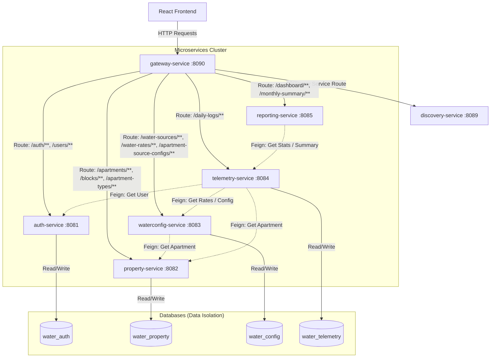
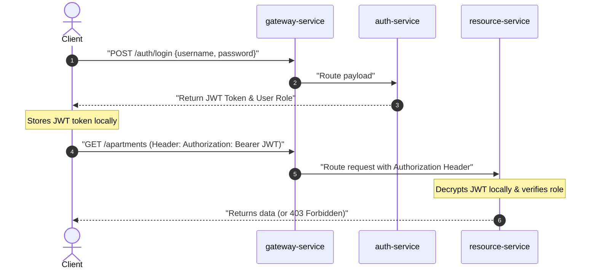

# Water Management System - API & Microservice Documentation

This document serves as a comprehensive reference guide to understand the backend microservice architecture, API design, security patterns, data schemas, and routing infrastructure of the system.

---

## 1. System Architecture Overview

The system is designed using a **Microservices Architecture** style. Each service is built with Spring Boot 3, Spring Security, and Spring Data JPA. The microservices register themselves with a central **Discovery Service** (Netflix Eureka) and communicate securely through an **API Gateway** (Spring Cloud Gateway).

### Architectural Component Diagram



### Core Design Decisions
1. **Database Per Service:** To prevent tight coupling, each microservice connects to its own isolated database schema (e.g., `water_auth`, `water_property`, etc.).
2. **Asynchronous/Decoupled References:** Services refer to models of other domains using plain Foreign Key IDs (e.g. `apartmentId` in `auth-service` and `telemetry-service`). Any necessary cross-domain data aggregation is performed at runtime using **OpenFeign clients**.
3. **Stateless Operations:** All user requests are fully stateless. There is no server-side HTTP session storage; authorization state is verified using JWT signatures.

---

## 2. Ports and Service Index

The cluster runs on the following default port assignments:

| Service Name | Port | Database Name | Description |
| :--- | :---: | :--- | :--- |
| `discovery-service` | `8089` | *None* | Netflix Eureka Server. Tracks all live service instances. |
| `gateway-service` | `8090` | *None* | Spring Cloud API Gateway. Serves as the single entry point. |
| `auth-service` | `8081` | `water_auth` | Manages credentials, roles (`ADMIN`, `RESIDENT`), and JWT token generation. |
| `property-service` | `8082` | `water_property` | Manages Blocks, Apartment Types, and individual Apartment units. |
| `waterconfig-service`| `8083` | `water_config` | Manages Water Sources, active Water Rates (slabs), and Apartment assignments. |
| `telemetry-service` | `8084` | `water_telemetry` | Captures daily water meter logs and calculates consumption metrics. |
| `reporting-service` | `8085` | *None* | Consolidates dashboard figures and generates monthly consumption/billing reports. |

---

## 3. Authentication & Security Model

The backend microservices utilize a stateless JWT security configuration.



- **Authentication Entry:** The only public, unauthenticated REST API endpoint is `/auth/login`.
- **Claims Extracted:** The JWT issued contains `sub` (username) and `role` claims (e.g. `ROLE_ADMIN`, `ROLE_RESIDENT`).
- **Authorization Filters:** All other services intercept requests using a `JwtAuthenticationFilter` which parses the `Authorization: Bearer <token>` header, decodes the claims using a shared secret, and registers the user's role context inside Spring Security.
- **Method-Level Security:** Endpoints utilize method-level annotations (e.g. `@PreAuthorize("hasRole('ADMIN')")`) to lock down modification capabilities to administrators.

---

## 4. Internal Microservice Communication (OpenFeign)

Spring Cloud OpenFeign clients are used to stitch data together across services at runtime:

- **`waterconfig-service` -> `property-service`**
  - **Client:** `PropertyServiceClient` fetches `ApartmentDto` from `/apartments/{id}` to validate assignments.
- **`reporting-service` -> `telemetry-service`**
  - **Client:** `TelemetryServiceClient` requests data aggregation via `/dashboard/stats` and `/monthly-summary`.
- **`telemetry-service` -> `property-service`**
  - **Client:** `PropertyServiceClient` fetches `ApartmentDto` by ID to match logs with block types and occupancy limits.
- **`telemetry-service` -> `waterconfig-service`**
  - **Client:** `WaterconfigServiceClient` fetches active source allocations (`/apartment-source-configs/apartment/{apartmentId}`) and billing schedules (`/water-rates/source/{sourceId}/date/{date}`).
- **`telemetry-service` -> `auth-service`**
  - **Client:** `AuthServiceClient` queries `/users/username/{username}` to match telemetry logs to specific residents.

---

## 5. Gateway Route Mappings

All client requests must target the API Gateway (`http://localhost:8090`). The gateway parses the incoming URL path and forwards the request to the matching microservice:

| Route Path Pattern | Destination Microservice | Load Balancer URI |
| :--- | :--- | :--- |
| `/auth/**`, `/users/**` | `auth-service` | `lb://auth-service` |
| `/apartments/**`, `/apartment-types/**`, `/blocks/**` | `property-service` | `lb://property-service` |
| `/water-sources/**`, `/water-rates/**`, `/apartment-source-configs/**` | `waterconfig-service` | `lb://waterconfig-service` |
| `/daily-logs/**` | `telemetry-service` | `lb://telemetry-service` |
| `/dashboard/**`, `/monthly-summary/**` | `reporting-service` | `lb://reporting-service` |

---

## 6. Detailed API Endpoints Catalog

### 6.1. Authentication Service (`auth-service`)

#### **POST** `/auth/login`
- **Description:** Authenticates credentials and returns a signed JWT.
- **Security:** Public.
- **Request Body (`application/json`):**
  ```json
  {
    "username": "admin",
    "password": "password"
  }
  ```
- **Response (`200 OK`):**
  ```json
  {
    "token": "eyJhbGciOiJIUzI1NiJ9.eyJzdWIiOiJhZG1pbiIsImNvbS5tYW5hZ2VtZW50LndhdGVyL...",
    "role": "ADMIN"
  }
  ```

#### **POST** `/users`
- **Description:** Registers a new resident user.
- **Security:** `ADMIN` role required.
- **Request Body (`application/json`):**
  ```json
  {
    "username": "resident_101",
    "password": "password123",
    "apartmentId": 1
  }
  ```
- **Response (`200 OK`):**
  ```json
  {
    "id": 5,
    "username": "resident_101",
    "role": "RESIDENT",
    "apartmentId": 1
  }
  ```

#### **GET** `/users`
- **Description:** Returns a list of all registered users.
- **Security:** `ADMIN` role required.

#### **GET** `/users/{id}`
- **Description:** Returns user detail for a given ID.
- **Security:** `ADMIN` role required.

#### **GET** `/users/username/{username}`
- **Description:** Returns user metadata for a given username.
- **Security:** Any authenticated user.

---

### 6.2. Property Service (`property-service`)

#### **POST** `/blocks`
- **Description:** Creates a building block section.
- **Security:** `ADMIN` role required.
- **Request Body (`application/json`):**
  ```json
  {
    "name": "Block B"
  }
  ```
- **Response (`200 OK`):**
  ```json
  {
    "id": 2,
    "name": "Block B"
  }
  ```

#### **GET** `/blocks`
- **Description:** Returns all building blocks.
- **Security:** Authenticated.

#### **DELETE** `/blocks/{id}`
- **Description:** Deletes a building block.
- **Security:** `ADMIN` role required.

#### **POST** `/apartment-types`
- **Description:** Adds a layout type defining standard water occupancy calculations.
- **Security:** `ADMIN` role required.
- **Request Body (`application/json`):**
  ```json
  {
    "name": "3BHK",
    "baseOccupancy": 5,
    "litresPerPerson": 150.0
  }
  ```

#### **GET** `/apartment-types`
- **Description:** Returns all layout categories.
- **Security:** Authenticated.

#### **POST** `/apartments`
- **Description:** Provisions a new apartment unit inside a block.
- **Security:** `ADMIN` role required.
- **Request Body (`application/json`):**
  ```json
  {
    "number": "B-204",
    "blockId": 2,
    "typeId": 1
  }
  ```

#### **GET** `/apartments`
- **Description:** Lists all apartment units.
- **Security:** `ADMIN` role required.

#### **GET** `/apartments/{id}`
- **Description:** Returns an apartment unit's details by ID.
- **Security:** Authenticated.

---

### 6.3. Water Configuration Service (`waterconfig-service`)

#### **POST** `/water-sources`
- **Description:** Registers a new water supplier.
- **Security:** `ADMIN` role required.
- **Request Body (`application/json`):**
  ```json
  {
    "name": "Ground Borewell",
    "pricingType": "FIXED",
    "supplyType": "GROUND"
  }
  ```
  *(Constraints: `pricingType` must be `SLAB` or `FIXED`. `supplyType` must be `MUNICIPAL`, `PRIVATE`, or `GROUND`)*

#### **GET** `/water-sources`
- **Description:** Lists all registered water providers.
- **Security:** Authenticated.

#### **POST** `/water-rates`
- **Description:** Creates a tariff structure bracket for a specific source.
- **Security:** `ADMIN` role required.
- **Request Body (`application/json`):**
  ```json
  {
    "minLitres": 0.0,
    "maxLitres": 10000.0,
    "ratePerLitre": 0.08,
    "effectiveFrom": "2026-07-01",
    "effectiveTo": "2026-12-31",
    "sourceId": 1
  }
  ```

#### **GET** `/water-rates`
- **Description:** Retrieves all water rate brackets.
- **Security:** Authenticated.

#### **GET** `/water-rates/source/{sourceId}/date/{date}`
- **Description:** Finds active billing rates for a source on a given date.
- **Security:** Authenticated.

#### **PUT** `/water-rates/{id}`
- **Description:** Modifies a water rate bracket.
- **Security:** `ADMIN` role required.

#### **DELETE** `/water-rates/{id}`
- **Description:** Deletes a water rate bracket.
- **Security:** `ADMIN` role required.

#### **POST** `/apartment-source-configs`
- **Description:** Configures a ratio allocation of a water source to an apartment.
- **Security:** `ADMIN` role required.
- **Request Body (`application/json`):**
  ```json
  {
    "ratioPercent": 40.0,
    "apartmentId": 1,
    "sourceId": 2
  }
  ```
  *(Constraint: Ratio percentages must be between 0.0 and 100.0)*

#### **GET** `/apartment-source-configs`
- **Description:** Retrieves all apartment allocations.
- **Security:** Authenticated.

#### **GET** `/apartment-source-configs/apartment/{apartmentId}`
- **Description:** Retrieves source allocations mapped to a specific apartment.
- **Security:** Authenticated.

---

### 6.4. Telemetry Service (`telemetry-service`)

#### **POST** `/daily-logs`
- **Description:** Submits daily water meter readings for a unit.
- **Security:** `ADMIN` role required.
- **Request Body (`application/json`):**
  ```json
  {
    "logDate": "2026-07-14",
    "totalLitresConsumed": 550.0,
    "guestCount": 1,
    "apartmentId": 1
  }
  ```

#### **GET** `/daily-logs`
- **Description:** Returns paginated telemetry log history.
- **Security:** Authenticated.
- **Query Parameters:**
  - `page` (default: `0`)
  - `size` (default: `20`)
  - `apartmentNumber` (optional filter)
  - `fromDate` (optional, `yyyy-MM-dd`)
  - `toDate` (optional, `yyyy-MM-dd`)
  - `sortBy` (default: `logDate`)
  - `sortDir` (default: `DESC`)

---

### 6.5. Reporting Service (`reporting-service`)

#### **GET** `/dashboard/stats`
- **Description:** Summarizes usage metrics for display.
- **Security:** Authenticated.
- **Request Header:**
  - `Authorization: Bearer <token>`
- **Query Parameters:**
  - `apartmentNumber` (optional)
  - `fromDate` (optional)
  - `toDate` (optional)
- **Response Schema:**
  ```json
  {
    "totalLitres": 23450.0,
    "totalCost": 1289.45,
    "averageLitresPerDay": 781.66,
    "guestContributions": 3100.0
  }
  ```

#### **GET** `/monthly-summary`
- **Description:** Compiles aggregate monthly water consumption costs.
- **Security:** `ADMIN` role required.
- **Request Header:**
  - `Authorization: Bearer <token>`
- **Query Parameters:**
  - `apartmentNumber` (optional)
  - `fromDate` (optional)
  - `toDate` (optional)
- **Response Schema:**
  ```json
  [
    {
      "month": "JULY",
      "year": 2026,
      "apartmentNumber": "B-204",
      "totalLitres": 15000.0,
      "baseCost": 600.0,
      "guestCost": 250.00,
      "totalCost": 850.00
    }
  ]
  ```

---

## 7. Data Models and DTOs

### 7.1. User Schema
```json
{
  "id": "Long",
  "username": "String",
  "role": "String (ADMIN | RESIDENT)",
  "apartmentId": "Long (nullable)"
}
```

### 7.2. Apartment Schema
```json
{
  "id": "Long",
  "number": "String",
  "block": {
    "id": "Long",
    "name": "String"
  },
  "type": {
    "id": "Long",
    "name": "String",
    "baseOccupancy": "Integer",
    "litresPerPerson": "Double"
  }
}
```

### 7.3. Water Source Schema
```json
{
  "id": "Long",
  "name": "String",
  "pricingType": "String (SLAB | FIXED)",
  "supplyType": "String (MUNICIPAL | PRIVATE | GROUND)"
}
```

### 7.4. Water Rate Schema
```json
{
  "id": "Long",
  "minLitres": "Double",
  "maxLitres": "Double",
  "ratePerLitre": "Double",
  "effectiveFrom": "LocalDate (yyyy-MM-dd)",
  "effectiveTo": "LocalDate (yyyy-MM-dd)",
  "source": "WaterSource"
}
```

### 7.5. Apartment Source Config Schema
```json
{
  "id": "Long",
  "ratioPercent": "Double",
  "apartmentId": "Long",
  "source": "WaterSource"
}
```

### 7.6. Daily Log Schema
```json
{
  "id": "Long",
  "logDate": "LocalDate (yyyy-MM-dd)",
  "totalLitresConsumed": "Double",
  "guestCount": "Integer",
  "apartmentId": "Long"
}
```

---

## 8. Global Error Response Schema

All REST services implement a unified exception handling mechanism utilizing Spring's `@RestControllerAdvice`. When an exception is thrown, the API returns a structured JSON payload representing the error:

### Error Payload Structure
```json
{
  "message": "String (Description of what failed, e.g. 'User not found')",
  "status": "Integer (HTTP status code, e.g. 404)",
  "timestamp": "LocalDateTime (Timestamp of the failure, e.g. '2026-07-14T11:05:56')"
}
```

### Standard Status Mappings
- `400 Bad Request`: Validation errors (e.g. invalid date formats, missing required fields, or negative inputs).
- `401 Unauthorized`: Credentials check failed or invalid JWT signatures.
- `403 Forbidden`: Token role does not meet the endpoint authorization requirements (e.g. a `RESIDENT` trying to access `/users` creation API).
- `404 Not Found`: Entity not found in database.
- `409 Conflict`: Unique constraint conflicts (e.g. creating a user with a username that already exists).
- `500 Internal Server Error`: Uncaught general exceptions.

---
